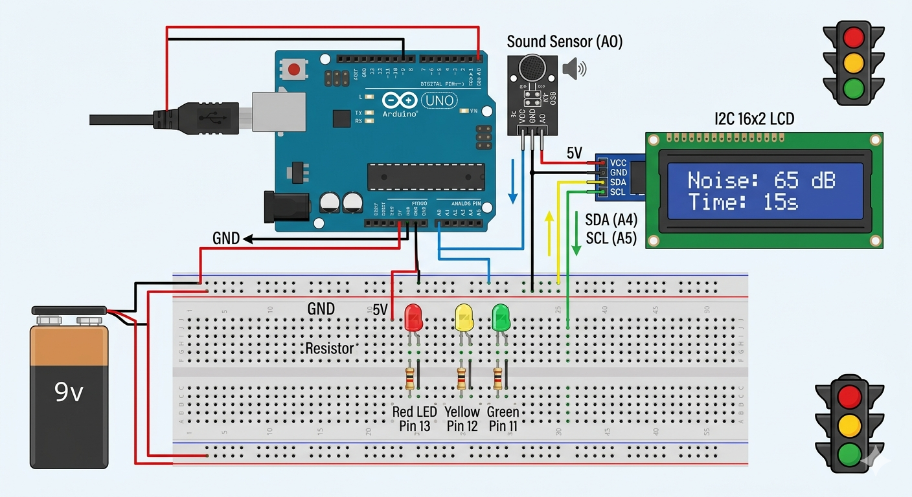

# Sonic Traffic Guard

## প্রজেক্টের প্রয়োজনীয় Components

এই প্রজেক্ট টি তৈরি করতে আমাদের যে যে components দরকার হবে - 

1. Arduino Uno
2. Jumper Wire 
3. Sound Sensor (MAX 9814) হইলে ভালো হয় 
4. External Power Unit (Battery) 
5. LCD প্যানেল 
6. একটা Breadboard 
7. লাল, সবুজ ও হলুদ LED
8. 220 Ohm Resistor 

## সার্কিট ডায়াগ্রাম

